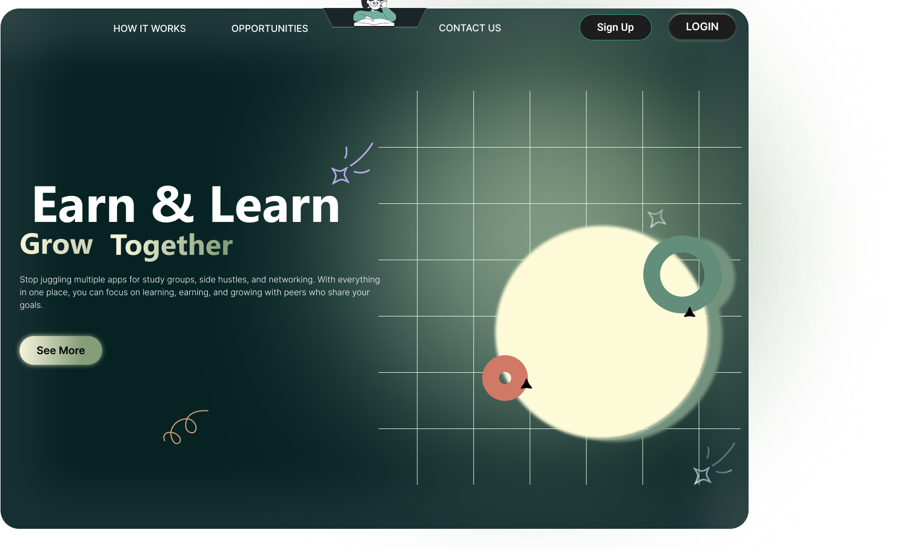
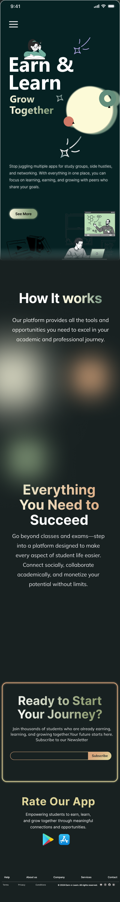
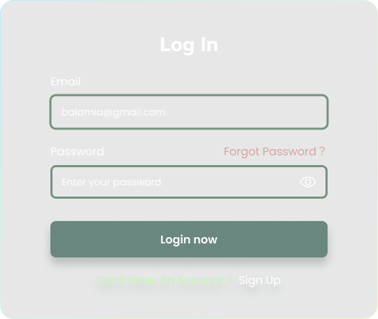
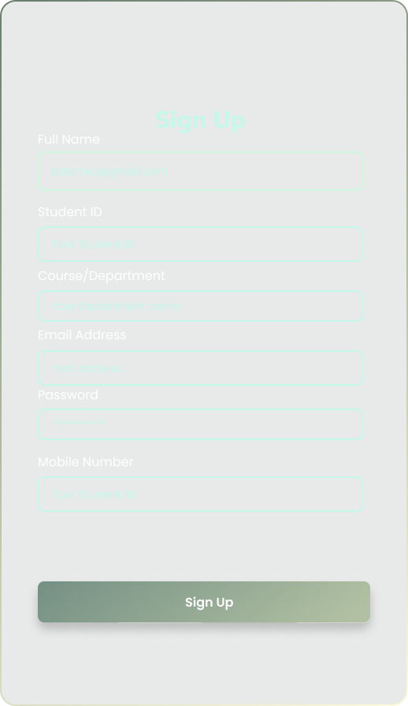
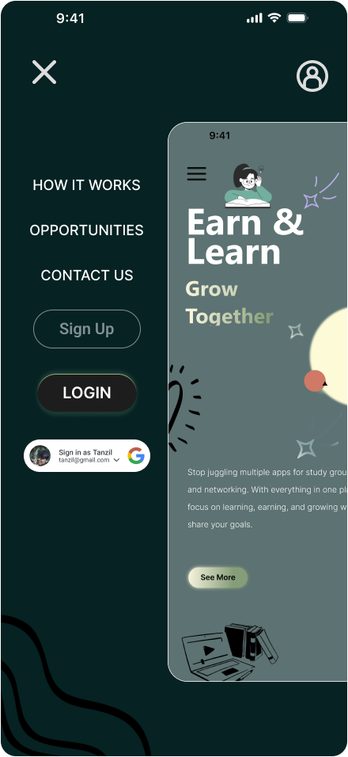
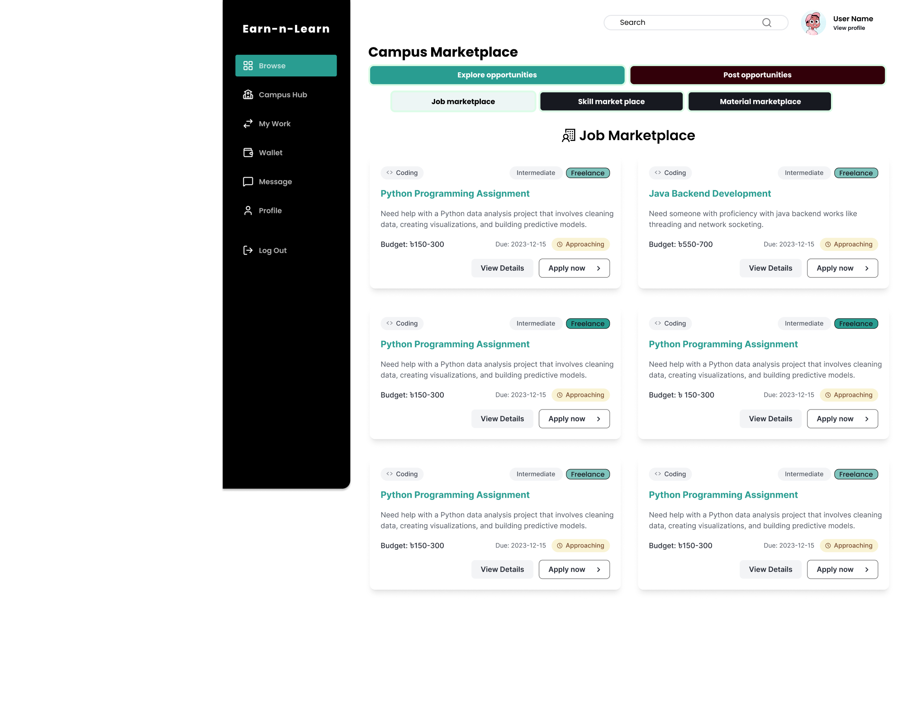
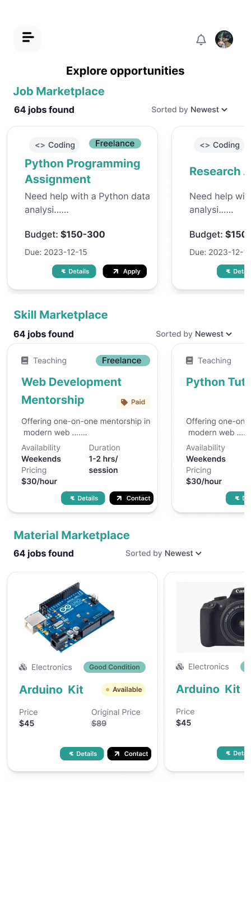

# Figma-Project-
# 🎓 Earn & Learn – Student Collaboration and Skill Marketplace

### 🧠 System Analysis & Design Course Project  
**Team Project | UI/UX Designed in Figma | Full-Stack Architecture (React + Node.js + MySQL)**  

---

## 🌍 Overview

**Earn & Learn** is a comprehensive **peer-to-peer student marketplace and collaboration platform** designed to empower students and freelancers.  
It allows users to **exchange skills, materials, and job opportunities**, while building a connected, productive, and financially aware **campus community**.

This project embodies both **academic rigor** (as part of a System Analysis and Design course) and **industry relevance**, bridging the gap between **student learning** and **real-world freelancing ecosystems**.

---

## 🎯 Purpose

The core mission of *Earn & Learn* is to create a **self-sustaining student economy** — where learners can:
- **Earn** through teaching, freelancing, and selling study materials  
- **Learn** from peers via tutoring, mentoring, and collaborations  
- **Collaborate** through community-driven projects, polls, and discussions  

By combining **social networking, marketplace, and project management** features, this system helps students gain experience, financial independence, and professional skills even before graduation.

---

## 🧩 Core Features

### 1. Marketplace System
- **Job Postings:** Post or browse jobs across skill categories  
- **Skill Sharing:** Offer tutoring or freelance services  
- **Material Exchange:** Share or sell textbooks, notes, and tools  
- **Smart Search & Filters:** Categorized and keyword-based filtering  
- **AI Recommendation Engine:** Personalized job and skill suggestions  

### 2. Campus Social Network
- **Post Feed:** Share thoughts, achievements, or opportunities  
- **Polls:** Conduct community voting on topics and events  
- **Interactions:** Like, comment, and share  
- **Content Filtering:** Search and filter posts efficiently  

### 3. Work Management (MyWork)
- **Application Tracking:** Sent and received job requests  
- **Contact Management:** Manage connections and client communications  
- **Project Collaboration:** Track ongoing project progress  
- **Invoice System:** Generate and manage invoices for payments  
- **Status Updates:** Accept/reject applications and update progress  

### 4. Real-Time Messaging
- **1-on-1 & Group Chats** using **Socket.IO**  
- **File Sharing:** Share documents and media  
- **Typing Indicators & Message History:** Real-time and persistent communication  

### 5. Wallet & Payment System
- **Digital Wallet:** Internal fund management  
- **SSLCommerz Integration:** Secure transactions (bKash, Nagad, Rocket, Card)  
- **Escrow Payments:** Trust-based protection for both parties  
- **Transaction History, Savings Goals & Expense Analytics**  

### 6. Project Management
- **Task Creation, Assignment, and Tracking**  
- **Time Logs & Milestones** for progress tracking  
- **Resource Sharing & Comments** for team communication  

### 7. Gamification & Rewards
- **Points, Badges, Leaderboards** to reward engagement  
- **Profile Stats** to showcase credibility and contributions  

### 8. User Profile System
- **Skill Portfolio, Reputation Score, and Public Profiles**  
- **Portfolio Section:** Showcase previous work and projects  

### 9. Notification System
- **Real-Time Alerts** for applications, messages, and payments  
- **Notification Center** for organized tracking  

### 10. Calendar Integration
- **Project Timelines** and **Event Scheduling**  

---

## 🧭 Design Principles Followed

- **Consistency:** Unified design language across mobile and web  
- **User-Centered Design:** Focused on the student’s workflow, needs, and usability  
- **Visual Hierarchy:** Prioritized readability, clarity, and functional grouping  
- **Accessibility:** Contrasting color palette for visibility and inclusivity  
- **Minimalism:** Clean, functional layouts inspired by modern productivity tools  
- **Scalability:** Adaptive grid system ensuring smooth transition from mobile to web  
- **Feedback Design:** Micro-interactions for user actions (loading, success, etc.)  
- **Cognitive Load Reduction:** Intuitive navigation and simplified information flow  

---

## 💻 Technology Stack

### Frontend
- **React 18 + TypeScript** – Modern, type-safe UI development  
- **Vite** – Fast build and hot reload  
- **Tailwind CSS + Shadcn/ui** – Clean, consistent UI components  
- **TanStack Query (React Query)** – API state synchronization  
- **React Hook Form + Zod** – Validation and input control  
- **Recharts, Lucide Icons, Embla Carousel, Sonner, Radix Toast** – Visuals and feedback  
- **Socket.IO Client** – Real-time communication layer  

### Backend
- **Node.js + Express.js** – Scalable REST API  
- **MySQL2** – Relational database  
- **Socket.IO** – WebSocket-based messaging and notifications  
- **JWT Authentication + bcryptjs** – Secure identity management  
- **Multer, CORS, dotenv** – File handling and environment setup  

### Payment Integration
- **SSLCommerz (Bangladesh)** – Supports card and mobile banking  
- Escrow-based protection for both client and freelancer  

### Architecture
- **MVC Pattern** – Separation of concerns  
- **RESTful API Design** – Clean, modular endpoints  
- **Component-Based Frontend** – Reusable UI logic  
- **Context API + Custom Hooks** – Global state and business logic isolation  

---

## 🌟 What Makes It Unique

1. 🧩 **All-in-One Platform** – Combines marketplace, collaboration, and payment in one cohesive system.  
2. 💳 **Local Payment Integration** – SSLCommerz enables **Bangladeshi students** to transact using local payment methods.  
3. 🧠 **AI-Driven Recommendations** – Personalized suggestions for opportunities and materials.  
4. 🔒 **Escrow Protection** – Ensures trust and transparency in peer-to-peer transactions.  
5. ⚡ **Real-Time Experience** – Live notifications, chat, and updates with Socket.IO.  
6. 🏫 **Campus-Oriented Design** – Tailored for students’ academic and social needs.  
7. 🎮 **Gamified Ecosystem** – Encourages engagement, contribution, and consistency.  
8. 📈 **Financial Literacy Tools** – Wallet analytics, expense tracking, and savings goals.  

---

## 🚀 Benefits for Students

- **Empowerment:** Gain income and skills through peer collaboration  
- **Networking:** Connect with peers, mentors, and clients within campus  
- **Skill Growth:** Build real-world project experience before graduation  
- **Portfolio Development:** Showcase projects and gain credibility  
- **Financial Management:** Learn digital payment handling and budgeting  
- **Community Impact:** Strengthen the ecosystem of student entrepreneurship  

---

## 📱 Platform Versions

- **Web Application:** Complete system experience for browsers  
- **Mobile Application (Optimized):** Streamlined experience for on-the-go users  

---

## 👥 Team Contribution

This project was designed and developed **collaboratively** as part of the  
📘 *System Analysis & Design* course — where each member contributed to analysis, architecture, and UI/UX design.  

---

## 🧩 Future Scope

- AI-based **Skill Matching System**  
- **Internship and Career Placement** integration  
- **E-learning Courses** and verified certifications  
- **Cross-Campus Collaboration** for multi-university use  

---

---

## 🎨 Figma Design Preview

This project was designed from scratch using **Figma**, applying modern design principles and responsive layout structures.

### 🌐 View the Full Prototype
👉 [View on Figma](https://www.figma.com/design/TnluYa7qpum7ozaP7nOO4S/Earn_ln_learn?node-id=0-1&t=5L66TDHoA8uDePBi-1)  
*(Click to open the interactive prototype)*

### 🖼️ UI Snapshots

| Web Dashboard | Mobile Version | 
|---------------|----------------|
|  | |

### 🔐 Landing Page Web

### 🔐 Login Page

### 🔐 Sign Up Page

### 🏠 Landing Page Mobile

### 🔐 Browse ( Web )

### 📝 Browse ( Mobile )

> The Figma design demonstrates consistent visual hierarchy, responsive scaling, and modern component-driven UI aligned with real-world web app standards.

## 🧑‍💻 Authors

---

## 👥 Team Members

| Name | Email |
|------|--------|
| **Abu Hurayra Mahbe** | [amahbe223043@bscse.uiu.ac.bd](mailto:amahbe223043@bscse.uiu.ac.bd) |
| **Tabassum Sumaiya** | [tsumaiya223295@bscse.uiu.ac.bd](mailto:tsumaiya223295@bscse.uiu.ac.bd) |
| **Md. Hasibul Hossain** | [mhossain223293@bscse.uiu.ac.bd](mailto:mhossain223293@bscse.uiu.ac.bd) |
| **Jarin Tabassum** | [jtabassum223836@bscse.uiu.ac.bd](mailto:jtabassum223836@bscse.uiu.ac.bd) |
| **Ashraful Islam Tanzil** | [atanzil223028@bscse.uiu.ac.bd](mailto:atanzil223028@bscse.uiu.ac.bd) |

---

---

### ⭐ “Earn knowledge. Share value. Build community.”  
> A system where students don’t just learn — they grow, earn, and contribute.

---
